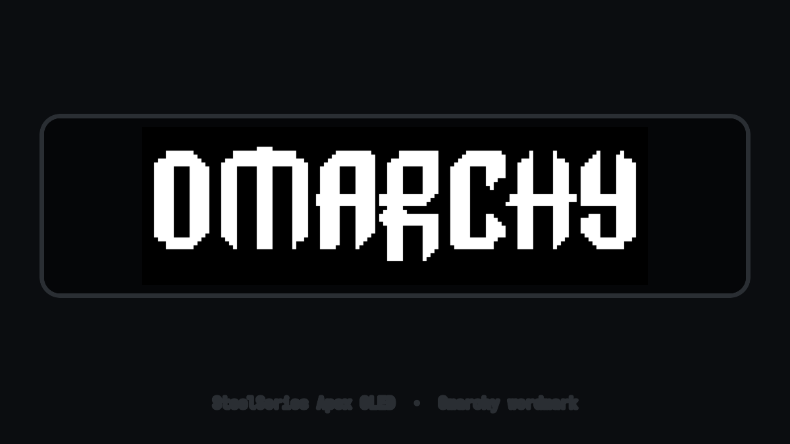
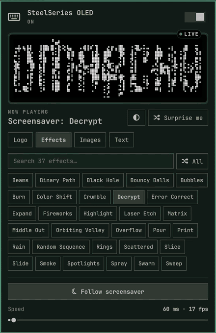
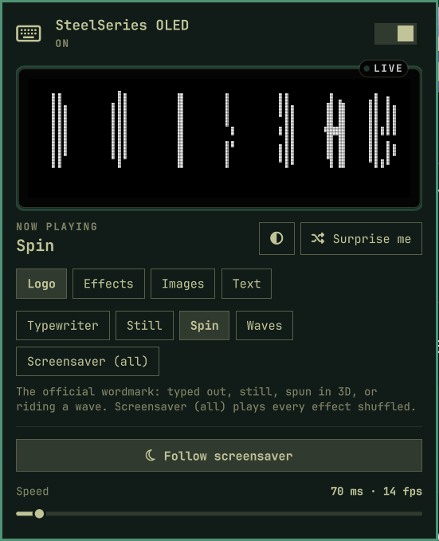
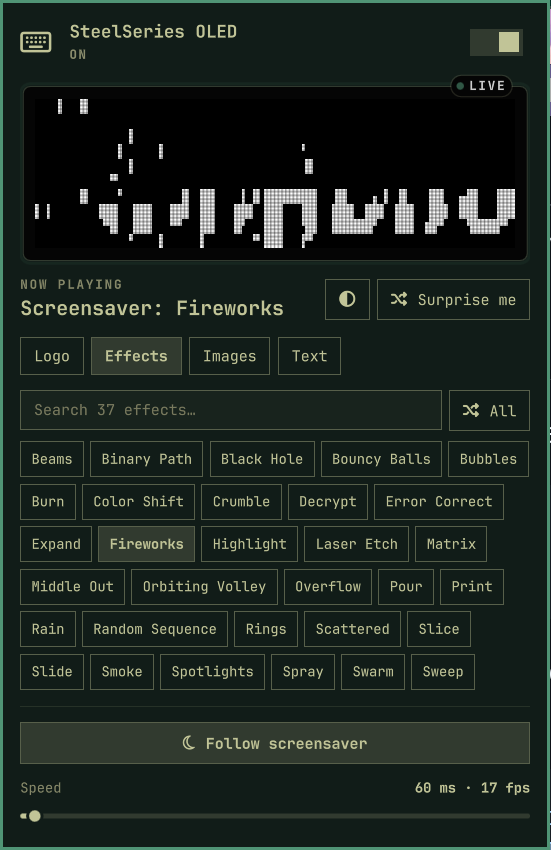
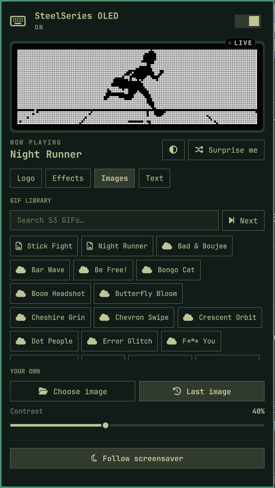
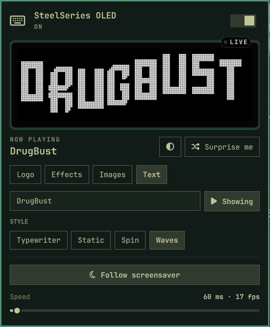
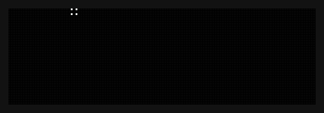
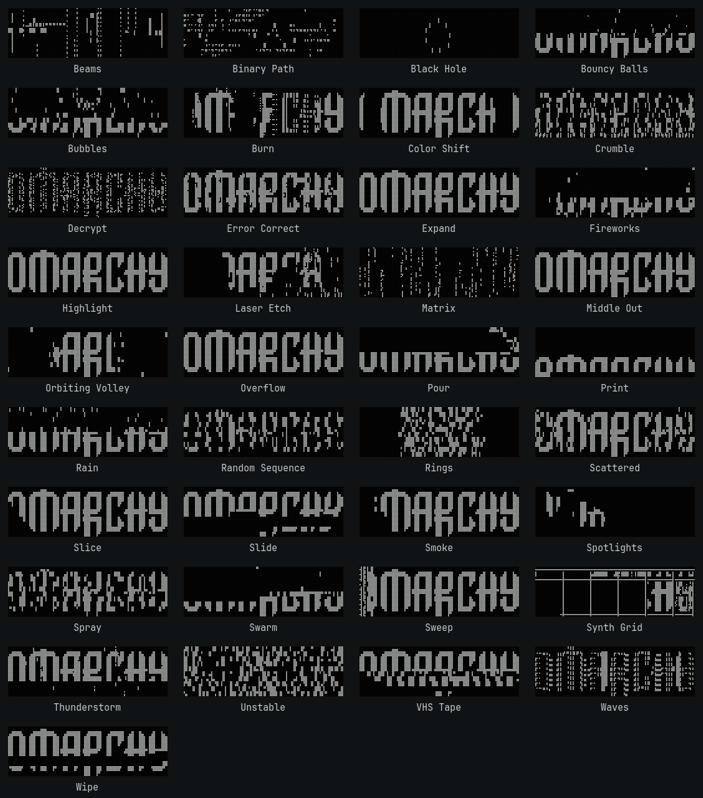
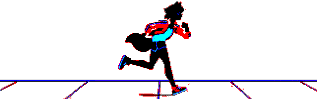

# SteelSeries OLED

Omarchy plugin for the OLED on a SteelSeries Apex keyboard: the official
**OMARCHY** wordmark by default, or a 3D spin/waves/static cycle of it, the
Omarchy screensaver's text effects, a
custom GIF or still image, a random pull from a bundled or online gif
library, or your own typed text — rendered in
**Omarchy Block**, a companion display font built for this plugin from the
wordmark's own letterforms.

A keyboard icon in the bar shows whether the GIF is looping. Click it for
status and a one-time udev install (polkit prompt). The service keeps
streaming after you unplug and replug.



The Apex OLED has no onboard animation storage — frames are streamed over
HID — so the onboard OLED menus will lose the fight while the service is
running. Turning Display off (or `apply.py --release`) blanks the panel.

## Gallery

The bar panel: a live, pixel-exact copy of the keyboard's screen up top, then
Logo · Effects · Images · Text · Create tabs. Here **Surprise me** hops through
screensaver effects, with a quick flip of **Invert** in the middle
([MP4](media/panel-demo.mp4)):



<table>
<tr>
<td align="center" width="50%"><b>Logo</b><br></td>
<td align="center" width="50%"><b>Effects</b><br></td>
</tr>
<tr>
<td align="center" width="50%"><b>Images</b><br></td>
<td align="center" width="50%"><b>Text</b><br></td>
</tr>
</table>

### Screensaver effects

All 37 effects from Omarchy's idle screensaver, recorded from `ttfx` and
rendered pixel-for-pixel as they appear on the 128×40 OLED
([MP4](media/oled-effects.mp4)):



<details>
<summary>Every effect, mid-animation</summary>



</details>

### Bundled art

<table>
<tr>
<td align="center" width="50%">

**Waves**: one step of the bundled wordmark cycle


</td>
<td align="center" width="50%">

**Night Runner**: one of the two GIFs that ship with the plugin



</td>
</tr>
</table>

## Supported keyboards

Same 128×40 legacy OLED protocol:

- Apex 7 and Apex 7 TKL (`1038:1612`, `1038:1618`)
- Apex Pro and Apex Pro TKL (`1038:1610`, `1038:1614`)
- Apex 5 (`1038:161c`)

## Install

One line clones the plugin, enables it, and grants keyboard access, with no
interactive prompts:

```sh
omarchy plugin add https://github.com/Auxxed/omarchy-steelseries-oled.git --enable --yes && \
sudo ~/.config/omarchy/plugins/io.github.auxxed.steelseries-oled/install-udev.sh
```

The widget lands on the right of the bar by default. Move it with:

```sh
omarchy bar move io.github.auxxed.steelseries-oled --section center
```

Drop `--yes` if you'd rather review the plugin and pick a bar section
interactively, and drop the `sudo` line if you'd rather grant keyboard
access later from the panel (**Allow access**, one polkit prompt) instead
of the command line — see [Keyboard access](#keyboard-access) below.

Runtime is `python3` (stdlib) for HID. Importing a custom GIF or still needs ImageMagick (`magick`), which Omarchy already ships.

### Keyboard access

The OLED is `/dev/hidraw*` on USB vendor `1038`, interface 1. A one-time udev
rule lets the seated session write it without root. The panel can install that
rule through a polkit prompt (fixed bytes, not a copy of the plugin tree). By
hand:

```sh
sudo ~/.config/omarchy/plugins/io.github.auxxed.steelseries-oled/install-udev.sh
```

The rule is named `71-steelseries-apex-oled.rules` so `TAG+="uaccess"` is
applied before systemd seat ACLs. It sets `MODE=0660` plus `uaccess` for the
listed Apex PIDs. It does not run any program. Unplug and replug if the ACL
does not land immediately.

## Usage

Left click the bar icon to open the panel.

- **Header switch** (or right-click the bar icon, or Space): turn the OLED on
  or off. Off blanks the panel.
- **Preview**: a live copy of what the keyboard shows. The badge reads LIVE
  while streaming, IDLE while following the screensaver.
- **◐ Invert** (or I): flip black and white. The preview follows.
- **Surprise me** (or R): a random pick from the tab you're on (a logo
  style, a screensaver effect, a library GIF, or a style for your text).
- **Logo** tab: Typewriter, Still, Spin, Waves, or **Screensaver (all)**,
  which plays all 37 effects shuffled, like the real screensaver.
- **Effects** tab: a searchable grid of every screensaver effect; click one
  to loop it on its own.
- **Images** tab: search the GIF library (Stick Fight and Night Runner ship
  with the plugin, the rest are fetched on demand from nlog.us), step through
  it with **Next**, **Choose image** to import your own GIF or still
  (png/jpg/webp/bmp, resized to 128×40 1-bit), or bring back your **Last
  image**. **Contrast** sets the 1-bit threshold for custom images.
- **Text** tab: type your own text (rendered in Omarchy Block, caps only)
  and pick a **style** (typewriter/static/spin/waves). **Show** switches the
  OLED to it.
- **Create** tab: draw your own 128×40 screen right on the preview. **Pen**,
  **Erase**, **Line** and **Box** tools, 1–5 px brushes (scroll on the screen
  to change size), right-click to erase, **Undo** (or Z), **Clear**, **Fill**,
  **Flip**, and **Copy screen** to start from the wordmark, your text or an
  image. Give it the logo's treatments: **Still** (updates the keyboard as
  you draw), **Typewriter**, **Spin** or **Waves**. Separate shapes animate
  like the logo's letters. Animated styles re-render a moment after you
  stop drawing; hover the screen to edit, move away to watch the loop.
- **Follow screensaver**: while Omarchy's idle screensaver is up, the OLED
  plays the screensaver effects too, then goes back to whatever it was showing.
- **Sleep when idle**: Never, 5, 10 (default), 30 or 60 minutes. After that
  long without input the OLED goes dark to spare it from burn-in, and wakes on
  the next keypress. Idle inhibitors (a playing video, stay-awake) keep it lit.
- **Speed**: frame delay (also shown as fps).
- **Allow keyboard access** (or U) appears only when the keyboard is present
  but not writable.
- `omarchy-shell io.github.auxxed.steelseries-oled power` toggles the OLED;
  `... sleepAfter 30` sets the idle timeout (0 turns it off).

## Remove

```sh
omarchy plugin remove io.github.auxxed.steelseries-oled
```

If the plugin directory is already gone, delete the rule by hand:

```sh
sudo rm -f /etc/udev/rules.d/71-steelseries-apex-oled.rules
sudo udevadm control --reload-rules
```

Removal does not factory-reset the OLED. Unplug the keyboard (or open its
onboard menu) to leave the firmware logo showing again. The udev rule, if you
installed it, stays until you remove that file yourself.

## Manual apply

```sh
# Loop the GIF in the foreground (Ctrl-C blanks the panel)
python3 ~/.config/omarchy/plugins/io.github.auxxed.steelseries-oled/apply.py

# Still wordmark only
python3 ~/.config/omarchy/plugins/io.github.auxxed.steelseries-oled/apply.py --once
python3 ~/.config/omarchy/plugins/io.github.auxxed.steelseries-oled/apply.py --invert

# Blank the panel
python3 ~/.config/omarchy/plugins/io.github.auxxed.steelseries-oled/apply.py --release

# Animate a 128x40 bitmap given as 1280 hex chars (row-major, MSB first)
python3 ~/.config/omarchy/plugins/io.github.auxxed.steelseries-oled/apply.py \
  --render-drawing "$(cat drawing.hex)" --style spin

# Render typed text (style: typewriter/static/spin/waves)
python3 ~/.config/omarchy/plugins/io.github.auxxed.steelseries-oled/apply.py \
  --render-text "HYPR" --style spin \
  --out-dir ~/.local/state/omarchy/steelseries-oled
```

`assets/omarchy-oled-128x40.gif` is the looping idle animation, with
`omarchy-oled-static.frames` and `omarchy-oled-spin.frames` and
`omarchy-oled-waves.frames` alongside it for the other bundled cycle steps.
Regenerate all of them from the still wordmark with `python3 make_gif.py`
(needs ImageMagick). `assets/screensaver/<effect>.frames` (one per effect,
with a `.gif` preview) come from `python3 make_screensaver.py [effect ...]`,
which records `ttfx` playing
`~/.config/omarchy/branding/screensaver.txt` in a pseudo-terminal and
rasterises each character cell onto the 128×40 panel (needs `ttfx` and
ImageMagick; build time only). The `.png` is the same still, sized for SteelSeries GG
if you ever set a static idle screen from Windows.

Plugin files: `manifest.json`, `Service.qml`, `OledBarWidget.qml`, `OledPanel.qml`,
`invert.frag`, `apply.py`, `make_gif.py`, `make_screensaver.py`, `udev/71-steelseries-apex-oled.rules`.

## How it works

A headless `service` starts `apply.py --watch`. That process finds USB vendor
`1038` on HID interface 1, then streams 642-byte feature reports (`0x61` + 640
packed pixels) at 10 fps — the same payload Linux Apex 7 tools have used for
years. JSON status lines drive the bar widget. A still is re-sent only twice a
second, and the helper exits by itself if the shell that started it goes away,
so a shell restart never leaves a second stream fighting over the panel.

The idle image lives in keyboard RAM. Firmware restores its own logo after a
power cycle unless this service is running.

Typed text goes through the same pipeline as a custom image: ImageMagick
rasterizes it in the chosen font, thresholds it to 1-bit at 128×40, and
`make_gif.py` turns that bitmap into an animation using the same per-letter
segmentation and spin/wave math it uses for the bundled wordmark — just
parameterized over however many letters were actually typed instead of a
fixed "OMARCHY".

## Marketplace

Category **Hardware**. Tags: `bar`, `quickshell`, `system`.

## License

MIT. See [LICENSE](LICENSE).

The wordmark is the official Omarchy mark from `logo.svg` (MIT), rasterized to
the Apex OLED's 128×40 1-bit panel. Omarchy and SteelSeries names are used to
describe the hardware and desktop this plugin talks to.

`assets/fonts/OmarchyBlock-Regular.ttf` ("Omarchy Block") is a companion
display font built for this plugin: it traces the real wordmark's 15-unit
grid letterforms from `logo.svg` for O/M/A/R/C/H/Y, then extends that same
chamfered-block, staircase-diagonal construction to the rest of A–Z and
0–9, so short custom-text lockups can match the logo's style. It's a
caps-only display face — lowercase maps to the same outlines, and it has no
extended punctuation, so typed text shows in capitals and characters it
doesn't cover are skipped.

`assets/stickfight.gif` is SteelSeries' own "Stick Fight" OLED gif from their
[OLED customization blog post](https://steelseries.com/blog/steelseries-oled-gifs-and-customization-137).
`assets/nightrunner.gif` is the "Night Runner" gif from
[this r/steelseries post](https://www.reddit.com/r/steelseries/comments/zou9mm/heres_a_gif_for_the_oled_screen_featuring_michiru/).
Both ship as bundled picks in the "grab a gif" cycle; the rest come from
[nlog.us's SteelSeries OLED gif page](https://www.nlog.us/ps/steelseries_oled_gifs.html)
and are fetched on demand rather than bundled.
